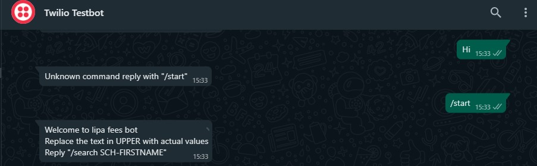

# Lipa Fees


## Description
<p>Lipa fees is an instruction driven WhatsApp Chatbot that allows students to conveniently pay their fees to institutions using M-PESA, a mobile money service. Users replace the UPPER texts with actual values and after confirming pay, an STK push is initiated directly to their phones.</p>

***This is a prototype version which uses M-PESA's simulation sandbox to push prompts and should therefore not be used to make actual payments***
<br>
<br>


## Table of Contents

- [Installation](#installation)
- [Usage](#usage)
- [Contributing](#contributing)
- [License](#license)

## Installation

1. Clone this repository
```bash
git clone https://github.com/hawkinswinja/lipa_fees.git
```
2. Navigate to the project directory: 
```bash
cd lipa_fees
```
3. Install requirements: 
```bash
pip install -r requirements.txt
```
4. Set up environment variables
    - Register accounts on [twilio](https://www.twilio.com/en-us) and [M-PESA API](https://developer.safaricom.co.ke/APIs)
    - Set up environment variables `CS `and `CK` using values from Daraja App's Consumer and Secret Key
    - Set up environment variables `ACCOUNT_SID` and `AUTH_TOKEN` using credentials from Twilio account
    - Replace the variable `pk` in chatbot.py with your daraja App's passkey
5. Run the command 
```bash
flask --app chatbot run
```
6. Install `Ngrok` and expose the application
```bash
ngrok http 5000
```
7. Update the status url of your sandbox settings in Twilio and the CallBackURL key of variable payload inside the chatbot.py to match your public url provided by Ngrok.

## Usage

1. Open WhatsApp and text `your sandbox code` to the number of your Twilio account eg.
    - Text `join birds-year` to `+1 (415) 523-8886` for this project's test.
2. Initiate payment by texting `/start`
3. Reply as instructed by the chatbot's prompt replacing all the text in upper case  with real values. 

## Contributing

Contributions are welcome! To contribute to this project, please follow these steps:

1. Fork the repository.
2. Create a new branch: `git checkout -b feature/your-feature`.
3. Make your changes and commit them: `git commit -m 'Add some feature'`.
4. Push to the branch: `git push origin feature/your-feature`.
5. Open a pull request.

## License

This project is licensed under the [MIT License](LICENSE).
